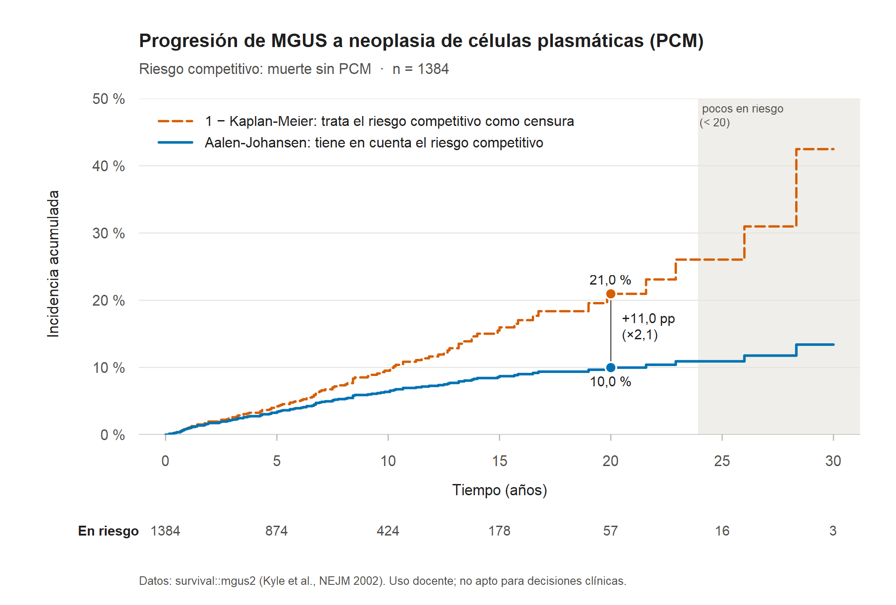

# Riesgos competitivos en R: Kaplan-Meier frente a Aalen-Johansen

[](https://github.com/Totejolo/muerte-no-es-censura/actions/workflows/tests.yml)

Plantilla pequeña en R (solo base R y `survival`) que muestra con datos públicos cuánto
sobreestima 1 − Kaplan-Meier la incidencia acumulada cuando la muerte se trata como censura, y
que aplica Aalen-Johansen, Fine-Gray y Cox por causa a tus propios datos en 5 minutos.

El ejemplo no es nuevo: la viñeta *Multi-state models and competing risks* del paquete
`survival` (Therneau, Crowson y Atkinson) ya usa `mgus2` para explicarlo. Lo que añade este
repositorio es una plantilla lista para tu CSV, con validación de la entrada y tests.

**Uso docente y de investigación. No es una herramienta clínica ni sirve para tomar decisiones
sobre pacientes.**

## El problema

En un seguimiento largo, muchos pacientes mueren antes de sufrir el evento que se estudia. Si
la muerte se trata como una censura más y se calcula 1 − Kaplan-Meier, se estima la incidencia
en un mundo hipotético en el que nadie muere de otra cosa, y el resultado sobreestima el riesgo
real. El estimador de Aalen-Johansen trata a quien muere como lo que es: alguien que ya no
puede tener el evento. En 1384 pacientes con gammapatía monoclonal de significado incierto
(MGUS; `survival::mgus2`, Mayo Clinic), 860 murieron sin progresar a una neoplasia de células
plasmáticas (PCM). A 20 años, 1 − Kaplan-Meier da un 21,0 % de progresión y Aalen-Johansen un
10,0 %: más del doble.

No es un error raro. En una revisión de ensayos clínicos publicados en revistas médicas
generales de alto impacto, 31 de 40 podían tener riesgos competitivos; de esos 31, 24 (77,4 %)
presentaron un análisis de Kaplan-Meier y solo 5 (16,1 %) la incidencia acumulada (Austin y
Fine, 2017).



## Cifras

Incidencia acumulada de PCM en `survival::mgus2` (n = 1384; 115 PCM, 860 muertes sin PCM,
409 censuras). Salida de `ejemplo_mgus2.R`; es la misma con las cuatro versiones de `survival`
probadas, de la 3.5-3 a la 3.8-12.

| Años (meses) | En riesgo | Aalen-Johansen (IC 95 %) | 1 − KM | Diferencia | 1 − KM / AJ |
|---|---:|---:|---:|---:|---:|
| 5 (60) | 874 | 3,4 % (2,6–4,5) | 4,2 % | +0,8 pp | 1,24 |
| 10 (120) | 424 | 6,4 % (5,2–7,9) | 9,5 % | +3,1 pp | 1,49 |
| 15 (180) | 178 | 8,7 % (7,2–10,5) | 16,0 % | +7,3 pp | 1,83 |
| 20 (240) | 57 | 10,0 % (8,2–12,1) | 21,0 % | +11,0 pp | 2,10 |
| 25 (300) | 16 * | 10,9 % (8,9–13,4) | 26,1 % | +15,1 pp | 2,39 |
| 30 (360) | 3 * | 13,4 % (10,0–18,0) | 42,5 % | +29,1 pp | 3,17 |

\* Menos de 20 pacientes en riesgo: estimación inestable (zona gris de la figura).

Modelos con edad y sexo (HR e IC 95 %):

| Covariable | sHR Fine-Gray, PCM | csHR Cox, PCM | csHR Cox, muerte sin PCM |
|---|---:|---:|---:|
| Edad (por año) | 0,983 (0,972–0,994) | 1,013 (0,997–1,030) | 1,067 (1,059–1,075) |
| Varón | 0,771 (0,536–1,110) | 0,975 (0,674–1,411) | 1,482 (1,293–1,699) |

La edad no se asocia con claridad a la tasa de progresión entre quienes siguen vivos (csHR
1,013), pero sí a la de muerte (csHR 1,067 por año). Como los mayores mueren antes de poder
progresar, su incidencia acumulada de PCM es menor (sHR 0,983). Las dos cosas son ciertas a la
vez porque responden a preguntas distintas.

Ojo con el sHR de la edad: en `mgus2` el supuesto de riesgos proporcionales del modelo de
Fine-Gray no se cumple para la edad (`cox.zph`, p < 0,001), como señala la propia viñeta de
`survival`. Léelo como un efecto promedio a lo largo del seguimiento, no como un efecto
constante.

## Pruébalo en 5 minutos

Necesitas R 4.2 o posterior ([CRAN](https://cran.r-project.org/)). `survival` viene con R;
no hay que instalar nada más.

1. Descarga el repositorio: `git clone https://github.com/Totejolo/muerte-no-es-censura.git`, o en
   GitHub, *Code → Download ZIP* y descomprímelo.
2. Abre una terminal en la carpeta del repositorio y ejecuta el ejemplo.

   **Linux y Mac**

   ```bash
   Rscript ejemplo_mgus2.R
   ```

   **Windows (PowerShell).** El instalador de R no suele añadir `Rscript` al PATH, y lo deja en
   `C:\Program Files\R` si lo instalas para todos los usuarios o en
   `%LOCALAPPDATA%\Programs\R` si lo instalas solo para ti. Esta línea lo busca en los dos
   sitios y después ejecuta el ejemplo:

   ```powershell
   $rscript = (Get-ChildItem "$env:ProgramFiles\R", "$env:LOCALAPPDATA\Programs\R" -Recurse -Filter Rscript.exe -ErrorAction SilentlyContinue | Select-Object -Last 1).FullName
   & $rscript ejemplo_mgus2.R
   ```

   En el símbolo del sistema (cmd), escribe la ruta completa entre comillas, con tu carpeta y tu
   versión: `"C:\Program Files\R\R-4.6.1\bin\Rscript.exe" ejemplo_mgus2.R`.

   **Desde R o RStudio**: `source("ruta/al/repositorio/ejemplo_mgus2.R", chdir = TRUE)`.

3. Mira la carpeta `resultados/`: `mgus2_figura.png`, `mgus2_tabla_aj_km.csv`,
   `mgus2_modelos.csv` y `mgus2_metadatos.txt` (fecha, versiones de R y de `survival`,
   entrada y parámetros). Tarda unos segundos.

## Con tus datos

1. Prepara un CSV con una fila por paciente: el tiempo desde el origen (diagnóstico,
   inclusión…) hasta el primer evento o la censura, y el estado en ese momento. Por ejemplo:

   ```text
   meses,estado,edad,sexo
   34,muerte,71,F
   120,PCM,64,M
   58,censura,69,F
   ```

2. Cópialo en `datos/`. Git ignora esa carpeta para que no subas datos de pacientes por error.
3. Edita el bloque `CONFIGURACIÓN` al principio de `plantilla.R`: fichero, separador (Excel en
   español suele usar `;` y coma decimal), codificación, columnas, códigos de censura, evento y
   competidores (numéricos o de texto, uno o varios por tipo), etiquetas, unidad de tiempo,
   tiempos de la tabla y covariables.
4. Ejecuta `Rscript plantilla.R` (en Windows, `& $rscript plantilla.R`). Los resultados salen en
   `resultados/plantilla_*`; los metadatos incluyen el md5 del CSV de entrada.

Sin editar nada, `plantilla.R` crea `datos/ejemplo_mgus2.csv` a partir de `survival::mgus2` y
reproduce las cifras de arriba en meses.

La plantilla se para con un mensaje claro si hay NA en el tiempo o en el estado, tiempos
negativos o infinitos, códigos no declarados, un mismo código en dos listas, ningún evento de
interés, covariables con valores infinitos o que no varían, o un CSV que no está en UTF-8 (te
propone `csv_encoding <- "latin1"`). Los modelos usan casos completos en las covariables, avisan
de cuántas filas quitan y avisan también si hay menos de 10 eventos por coeficiente. Los tiempos
de la tabla posteriores al último seguimiento salen como NA, y en la figura las curvas se cortan
en el último seguimiento.

Las funciones también se pueden usar directamente:

```r
source("R/riesgos_competitivos.R")
datos <- prepare_competing_data(mi_tabla, time = "meses", status = "estado",
                                event_codes = "PCM", competing_codes = "muerte",
                                censor_codes = "censura", covariates = c("edad", "sexo"))
compare_aj_km(datos, times = c(60, 120))           # tabla AJ frente a 1 - KM
plot_aj_vs_km(datos, file = "figura.png")          # gráfico
fit_competing_models(datos, c("edad", "sexo"))     # Fine-Gray y Cox por causa
```

## Qué pregunta responde cada método

| Método | Pregunta que responde | Para qué sirve |
|---|---|---|
| Aalen-Johansen (AJ) | ¿Qué proporción de pacientes habrá tenido el evento a tiempo *t*, con la mortalidad que hay de verdad? | Riesgo absoluto: pronóstico, información al paciente, planificación. Es la incidencia acumulada. |
| 1 − Kaplan-Meier con el competidor como censura | ¿Qué proporción lo tendría si nadie pudiera morir antes y quien muere tuviera, de haber seguido vivo, el mismo riesgo que los demás? | Un mundo hipotético que no se puede comprobar con los datos. Siempre da un valor igual o mayor que AJ. |
| Cox por causa (csHR) | ¿Cómo cambia la covariable la tasa instantánea del evento entre quienes siguen vivos y sin evento? | Preguntas etiológicas. No se traduce directamente en riesgo absoluto. |
| Fine-Gray (sHR) | ¿Cómo se asocia la covariable con la incidencia acumulada del evento? | Pronóstico. Mezcla el efecto sobre el evento con el efecto sobre el competidor. |

Lo recomendable es presentar la incidencia acumulada y los modelos por causa de todos los
eventos, no solo el del evento de interés (Latouche et al., 2013). Fine-Gray no es la opción
por defecto: si se ajusta un modelo de Fine-Gray para cada causa, las incidencias acumuladas
que predicen pueden sumar más de 1 (Austin, Steyerberg y Putter, 2021).

## Limitaciones

- **Censura independiente.** Todos los métodos suponen que la censura no depende del riesgo:
  si quienes se pierden tienen más o menos riesgo que quienes siguen, las estimaciones se
  sesgan. 1 − KM supone además que el competidor se comporta como una censura independiente, algo
  que los datos no permiten comprobar.
- **Cola inestable.** Con pocos pacientes en riesgo cada evento mueve mucho la curva: en
  `mgus2`, a 30 años quedan 3 en riesgo y 1 − KM salta al 42,5 %. Por debajo de 20 en riesgo se
  marca la estimación como inestable; el umbral es orientativo y se cambia con `min_at_risk`.
- **Supuestos de Fine-Gray.** Riesgos de subdistribución proporcionales: revísalos, por ejemplo,
  con `cox.zph(attr(modelos, "fits")$fine_gray)`; en `mgus2` fallan para la edad. El sHR no es
  una razón de tasas, porque quien ya tuvo el competidor sigue en el conjunto de riesgo. Los
  pesos de censura suponen que la censura no depende de las covariables.
- **Implementación.** Fine-Gray se ajusta con `survival::finegray()` y un `coxph()` ponderado,
  con error estándar robusto agrupado por paciente. Sin empates da los mismos coeficientes que
  `cmprsk::crr()` cuando este converge del todo; con empates, como en `mgus2`, difieren en el
  cuarto decimal, muy por debajo del error estándar. El IC 95 % de AJ es el de `survfit()`
  (jackknife infinitesimal, escala logarítmica); para 1 − KM no se da IC.
- **Referencias de los tests.** Las cifras de `tests/referencia_mgus2*.csv` salen del propio
  `survival`: detectan regresiones, pero no son una validación independiente. Lo independiente es
  el Aalen-Johansen escrito a mano en los tests y la comparación de Fine-Gray con `cmprsk::crr()`.
- **Datos.** `mgus2` tiene 1384 filas y 115 progresiones, las mismas cifras que el resumen de
  Kyle et al. (2002); su página de ayuda habla de 1341 pacientes. Este repositorio no intenta
  replicar el artículo.
- **Alcance.** Una fila por paciente y primer evento; sin entrada retardada, sin covariables
  dependientes del tiempo y sin estratos.
- **Uso docente y de investigación.** Los resultados no son una validación clínica.

## Tests

```bash
Rscript tests/run_tests.R
```

Sin frameworks: solo base R y `survival`. Son 89 comprobaciones y salen con código distinto de
0 si algo falla. Comprueban, entre otras cosas, que:

- el AJ de `survfit()` coincide con una implementación escrita a mano (tolerancia 1e-10);
- sin competidores, AJ = 1 − KM, y con competidores, 1 − KM ≥ AJ en todos los tiempos;
- la suma de las incidencias acumuladas de todas las causas más la supervivencia global es 1;
- las cifras de `mgus2` coinciden con las tablas de referencia versionadas en `tests/`;
- Fine-Gray de `survival` coincide con `cmprsk::crr()` (si `cmprsk` no está instalado, esa
  parte se omite con aviso; `install.packages("cmprsk")` la activa);
- cada error de validación salta cuando debe y los tiempos fuera del seguimiento dan NA;
- el gráfico dibuja las dos curvas, cada una con su color, y las corta en el último seguimiento;
- las tablas CSV y los metadatos exportados se releen con los mismos valores;
- `plantilla.R` y `ejemplo_mgus2.R` funcionan de principio a fin desde una carpeta con espacios.

Los tests se han puesto a prueba con 11 mutaciones: cambios pequeños que rompen el código a
propósito (un recuento, un umbral, el formato, la exportación, el gráfico). Cada una hace fallar
al menos un test.

GitHub Actions ejecuta los tests, el ejemplo y la plantilla en Ubuntu, Windows y macOS con la
última versión de R, y en Ubuntu con la versión anterior y con R 4.2, con `cmprsk` obligatorio.
Los tests pasan con `survival` 3.5-3, 3.5-8, 3.8-6 y 3.8-12. En macOS sin XQuartz se omite la
comprobación del SVG, porque `svg()` necesita cairo.

## Estructura

```text
R/riesgos_competitivos.R     funciones (base R + survival)
ejemplo_mgus2.R              ejemplo de 5 minutos con survival::mgus2
plantilla.R                  plantilla para tu CSV
tests/run_tests.R            tests sin frameworks
tests/referencia_mgus2*.csv  cifras de referencia de mgus2 (survival 3.5-8)
resultados/                  salidas; solo se versiona la figura del README
datos/                       tus datos; git la ignora
```

## Referencias

Comprobadas el 30-9-2026 en PubMed, en la documentación instalada de `survival` y `cmprsk` o en
la web de los autores:

- Aalen OO, Johansen S. An empirical transition matrix for non-homogeneous Markov chains based on
  censored observations. *Scand J Stat*. 1978;5:141-150.
- Austin PC, Fine JP. Accounting for competing risks in randomized controlled trials: a review
  and recommendations for improvement. *Stat Med*. 2017;36:1203-1209. doi:10.1002/sim.7215
- Austin PC, Lee DS, Fine JP. Introduction to the analysis of survival data in the presence of
  competing risks. *Circulation*. 2016;133:601-609. doi:10.1161/CIRCULATIONAHA.115.017719
- Austin PC, Steyerberg EW, Putter H. Fine-Gray subdistribution hazard models to simultaneously
  estimate the absolute risk of different event types: cumulative total failure probability may
  exceed 1. *Stat Med*. 2021;40:4200-4212. doi:10.1002/sim.9023
- Fine JP, Gray RJ. A proportional hazards model for the subdistribution of a competing risk.
  *J Am Stat Assoc*. 1999;94:496-509. doi:10.1080/01621459.1999.10474144
- Geskus RB. Cause-specific cumulative incidence estimation and the Fine and Gray model under
  both left truncation and right censoring. *Biometrics*. 2011;67:39-49.
- Kyle RA, Therneau TM, Rajkumar SV, Offord JR, Larson DR, Plevak MF, Melton LJ 3rd. A long-term
  study of prognosis in monoclonal gammopathy of undetermined significance. *N Engl J Med*.
  2002;346:564-569. doi:10.1056/NEJMoa01133202
- Latouche A, Allignol A, Beyersmann J, Labopin M, Fine JP. A competing risks analysis should
  report results on all cause-specific hazards and cumulative incidence functions. *J Clin
  Epidemiol*. 2013;66:648-653. doi:10.1016/j.jclinepi.2012.09.017
- Okabe M, Ito K. Color Universal Design (CUD): how to make figures and presentations that are
  friendly to colorblind people. 2002, revisada en 2008. <https://jfly.uni-koeln.de/color/>. La
  figura usa dos colores de esa paleta, tal como la trae R en `grDevices::palette.colors()`.
- Putter H, Fiocco M, Geskus RB. Tutorial in biostatistics: competing risks and multi-state
  models. *Stat Med*. 2007;26:2389-2430. doi:10.1002/sim.2712
- Therneau T, Crowson C, Atkinson E. Multi-state models and competing risks. Viñeta del paquete
  `survival`.
- Therneau T. *A Package for Survival Analysis in R*. Paquete de R `survival`.
  <https://CRAN.R-project.org/package=survival>
- Gray B. *cmprsk: Subdistribution Analysis of Competing Risks*. Paquete de R.
  <https://CRAN.R-project.org/package=cmprsk>

## Licencia

MIT; ver [LICENSE](LICENSE). Los datos de `mgus2` vienen con el paquete `survival` y no se
copian en este repositorio: el ejemplo y la plantilla los leen o generan al ejecutarse.

## Summary in English

A small R template (base R and `survival` only) showing, with public data, how much
1 − Kaplan-Meier overestimates cumulative incidence when death is treated as censoring, and
applying Aalen-Johansen, Fine-Gray and cause-specific Cox models to your own CSV in five
minutes. The `mgus2` example itself is not new (it is in the competing risks vignette of
`survival`); the template, input validation and tests are. In 1384 patients with MGUS
(`survival::mgus2`), 860 died without progressing to a plasma cell malignancy; at 20 years
1 − KM gives 21.0 % progression versus 10.0 % with Aalen-Johansen (57 patients still at risk).
Run `Rscript ejemplo_mgus2.R` for the example, edit the configuration block of `plantilla.R`
for your own data, and run `Rscript tests/run_tests.R` for the 89 framework-free checks
(hand-written Aalen-Johansen, identities, versioned reference values, Fine-Gray against
`cmprsk::crr`, input validation, exports, the plot and both scripts end to end). The tests were
checked with 11 mutations; each one makes at least one test fail. Limitations: independent censoring,
unstable tails, Fine-Gray assumptions (proportionality fails for age in `mgus2`); one row per
patient, no delayed entry or time-varying covariates. For teaching and research only, not for
clinical decisions. MIT licence.
